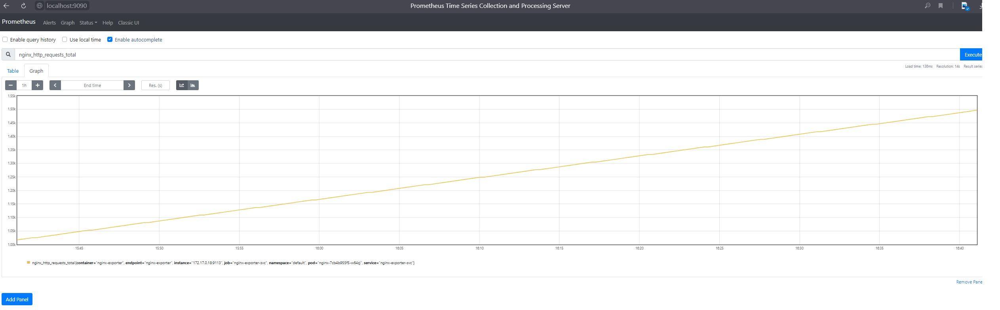
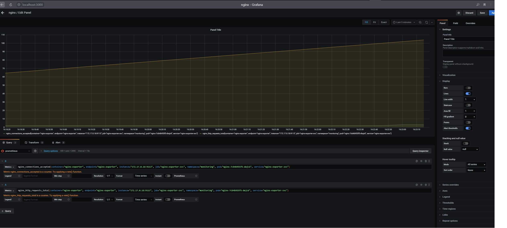

# Домашнее задание kubernetes-operators:
:white_check_mark: сделал задание  “уткой”

:white_check_mark: сделал 1е задание, но не уверен что верно и не уверен что сделал 🌟

:white_check_mark: сделал 2е задание 🌟

## MySQL контроллер
Вопрос: почему объект создался, хотя мы создали CR, до того, как запустили контроллер?

Ответ: потому что событие никто не вычитал, оно висело в очереди. При создании контроллера он вычитал и обработал.

Проверяем что появились pvc:
```bash
	NAME                        STATUS   VOLUME                                     CAPACITY   ACCESS MODES   STORAGECLASS   AGE
		backup-mysql-instance-pvc   Bound    pvc-f8efe37e-a7f3-4c17-8299-a57d9269af77   1Gi        RWO            standard       143m
		mysql-instance-pvc          Bound    pvc-f3e429e5-ac91-4365-b334-8f7bd49619bf   1Gi        RWO            standard       102m
```		
	
Посмотрим содержимое таблицы:
```bash
+----+-------------+
| id | name        |
+----+-------------+
|  1 | some data   |
|  2 | some data-2 |
+----+-------------+
```

Удалим mysql-instance:
```bash
	NAME                                       CAPACITY   ACCESS MODES   RECLAIM POLICY   STATUS      CLAIM                               STORAGECLASS   REASON   AGE
	backup-mysql-instance-pv                   1Gi        RWO            Retain           Available                                                               154m
```

Создадим заново mysql-instance:
```bash
+----+-------------+
| id | name        |
+----+-------------+
|  1 | some data   |
|  2 | some data-2 |
+----+-------------+
```

База взята из бэкапа.

вывод комманды kubectl get jobs:
```bash
@:~/evbedarev_platform/kubernetes-operators/deploy$ kubectl get jobs
NAME                         COMPLETIONS   DURATION   AGE
backup-mysql-instance-job    1/1           3s         95s
restore-mysql-instance-job   1/1           73s        79s
```
## Задание со 🌟 (1).
В процедуру msyql_on_create, в try где создается backup_pv добавим создание строковой переменной
и присвоим значение "Without restore job". После блока try добавим проверку на существование переменной
и если этой переменной нет, создадим со значением "With restore job"
```python
   try:
        backup_pv = render_template('backup-pv.yml.j2', {'name': name})
        api = kubernetes.client.CoreV1Api()
        api.create_persistent_volume(backup_pv)
        message = "Without restore job"
    except kubernetes.client.rest.ApiException:
        pass
    if 'message' not in locals():
        message = "With restore job"
```
Добавляем в конец процедуры mysql_on_create возврат значения, которое будет отображаться в Event'ах.
```python
return {'message': message}
```
Так же в сrd определим subresources status согласно документации kubernetes:
```yaml
  versions:
  - name: v1
    subresources:
      status: {}
```
Теперь после создания объекта в Event'ax появляются сообщения о том как создан этот:
```bash
Events:
  Type     Reason   Age   From  Message
  ----     ------   ----  ----  -------
  Normal   Logging  18s   kopf  Creation event is processed: 1 succeeded; 0 failed.
  Warning  Logging  18s   kopf  Patching failed with inconsistencies: (('remove', ('status',), {'mysql_on_create': {'message': 'Without restore job'}}, None),)
  Normal   Logging  18s   kopf  Handler 'mysql_on_create' succeeded.
```
Только у меня это как-то криво работает. Хотя в примерах kopf return такое прокатывает.
Подскажите пожалуйста где я накосячил?

## Задание со 🌟 (2):

1. Смотрим текущий пароль пода (kubectl describe pod mysql-instance-75fccbd7f4-zlmxv)
```bash
Environment:
	MYSQL_ROOT_PASSWORD:  otuspassword2
	MYSQL_DATABASE:       otus-database
```
      
Смотрим в cr.yml
```bash
password: otuspassword2
```
		
2. проверяю что база доступна с этим паролем (kubectl exec -it $MYSQLPOD -- mysql -potuspassword2 -e "select * from test;" otus-database):
```bash
+----+-------------+
| id | name        |
+----+-------------+
|  1 | some data   |
|  2 | some data-2 |
+----+-------------+
```
3. меняю пароль в cr.yml на otuspassword3

4. применяю. controller log:
```bash
password changed to: otuspassword3
job change-mysql-instance-job end without errors
delete job: restore-mysql-instance-job
job restore-mysql-instance-job end without errors
old_pwd value: otuspassword2, new_pwd value: otuspassword3
[2021-01-13 18:34:06,905] kopf.objects         [INFO    ] [default/mysql-instance] Handler 'change_handler' succeeded.
[2021-01-13 18:34:06,906] kopf.objects         [INFO    ] [default/mysql-instance] Update event is processed: 1 succeeded; 0 failed.
```
5. смотрим что с подом:
```bash
		NAME                               READY   STATUS      RESTARTS   AGE
		mysql-instance-d9d5f4445-7gtt9     1/1     Running     0          55s
		restore-mysql-instance-job-6hk9q   0/1     Completed   3          55s
```
	Смотри что внутри пода (kubectl describe pod mysql-instance-d9d5f4445-7gtt9):
```bash	
Environment:
		MYSQL_ROOT_PASSWORD:  otuspassword3
		MYSQL_DATABASE:       otus-database
```				
  Смотрим на под restore (kubectl describe pod restore-mysql-instance-job-6hk9q):
```bash
Command:
      /bin/sh
      -c
      mysql -u root -h mysql-instance -potuspassword3 otus-database< /backup-mysql-instance-pv/mysql-instance-dump.sql
```			
6. Пытаюсь подключиться с новым паролем:
```bash
mj@debian:~/kubernetes-operators/deploy$ kubectl exec -it $MYSQLPOD -- mysql -potuspassword3 -e "select * from test;" otus-database
mysql: [Warning] Using a password on the command line interface can be insecure.
+----+-------------+
| id | name        |
+----+-------------+
|  1 | some data   |
|  2 | some data-2 |
+----+-------------+
```
## Код:
```python
#меняет пароль от текущей базы
def change_curr_pwd(name, password, new_password, database):
    print(f"get name: {name}")
    #инициализация задания из шаблона, передача параметров
    change_pwd = render_template('change-pwd-job.yml.j2', {'name': name,'password': password,'new_password': new_password,'database': database})
    api = kubernetes.client.BatchV1Api()
    try:
        #Создаем задание на изменеие пароля
        api.create_namespaced_job('default', change_pwd)
    except kubernetes.client.rest.ApiException:
        pass
    print(f"password changed to: {new_password}")
    #Ожидаем пока задание выполниться
    wait_until_job_end(f"change-{name}-job")
    try:
        #Удаляем задание на изменение
        api.delete_namespaced_job(f"change-{name}-job",'default',propagation_policy='Background')
    except kubernetes.client.rest.ApiException:
        pass

#функция на обновление ресурсов с новым паролем(deployment)
def update_res(name, image, password, database, body):
    api = kubernetes.client.AppsV1Api()
    apiBatch = kubernetes.client.BatchV1Api()
    print(f"delete job: restore-{name}-job")
    try:
        #удаляем деплоймент
        api.delete_namespaced_deployment(name,'default',propagation_policy='Background')
    except kubernetes.client.rest.ApiException:
        pass
    #Инициализируем деплоймент с новым паролем
    deployment = render_template('mysql-deployment.yml.j2', {
        'name': name,
        'image': image,
        'password': password,
        'database': database})
    kopf.append_owner_reference(deployment, owner=body)
    #Создаем деплоймент и задание
    try:
        api.create_namespaced_deployment('default', deployment)
        api = kubernetes.client.BatchV1Api()
    except kubernetes.client.rest.ApiException:
        pass

#Запускем функцию change_handler при наступлении события update
@kopf.on.update('otus.homework', 'v1', 'mysqls')
def change_handler(body, old, new, diff, **_):
    old_password = old['spec']['password']
    new_password = new['spec']['password']
    #если старый пароль отличается от нового то начинаем
    if (old_password != new_password):
        name = body['metadata']['name']
        image = body['spec']['image']
        database = body['spec']['database']

        change_curr_pwd(name, old_password, new_password, database)
        update_res(name, image, new_password, database, body)
        print(f"old_pwd value: {old_password}, new_pwd value: {new_password}")


```
Шаблон change-pwd-job.yml.j2:
```yaml
apiVersion: batch/v1
kind: Job
metadata:
  namespace: default
  name: change-{{ name }}-job
spec:
  template:
    metadata:
      name: change-{{ name }}-job
    spec:
      restartPolicy: OnFailure
      containers:
      - name: backup
        image: mysql:5.7
        imagePullPolicy: IfNotPresent
        command:
        - /bin/sh
        - -c
        - mysql -u root -h {{ name }} -p{{ password }} -e " UPDATE mysql.user SET authentication_string=PASSWORD('{{new_password}}') WHERE user='root';FLUSH PRIVILEGES;"  {{ database }}
```
# Домашнее задание kubernetes-monitoring:
___Уровень: Bring`em on!___
## Dockerfile
1. Создал Dockerfile. Взял базовый  образ Centos 7 , установил nginx.
- Были проблемы с передачей переменной в конфиг nginx. Получилось решить с помощью envsubst.
## Nginx & Nginx exporter
2. Создал деплоймент с тремя контейнерами nginx, порты передаються с помощью env.
- А так же контейнер с nginx-exporter собирает метрики с порта 8081, плюс Service для nginx-exporter
- Устанавливаем деплоймент и севис.
## Prometheus
3. Клонирую репозиторий [prometheus-operator](https://github.com/prometheus-operator/kube-prometheus "prometheus-operator")
4. Устанавливаю:
```bash
kubectl create -f manifests/setup
kubectl create -f manifests/
```
5. В ServiceMonitor указываю matchLabels: nameapp: nginx-exporter.
6. с помощью kubectl port-forward лезем на localhost:9090. И наблюдаем target: node-exporter

## Prometheus


## Grafana
График:


# Домашняя работа kubernetes-logging
## EFK
1. Подготовка kubernetes кластера
- Создал 1 ноду default-pool и 3 ноды infra-pool
- назначил taint на ноды infa
2. Установил HipsterShop
3. Установка EFK стека | Helm charts
- установил elastic & kibana & fluent-bit
- добавил tolerations в elasticsearch.values.yaml
```yaml
tolerations:
  - key: node-role
    operator: Equal
    value: infra
    effect: NoSchedule
```
- добавил nodeSelector в elasticsearch.values.yaml
```yaml
nodeSelector:
  cloud.google.com/gke-nodepool: infra-pool
```
получилось: 
```bash
mj@mjbian:~/Documents/kubernetes-logging$ kubectl get pods -n logging -o wide -n observability
NAME                     READY   STATUS    RESTARTS   AGE    IP         NODE                                     NOMINATED NODE   READINESS GATES
elasticsearch-master-0   1/1     Running   0          2m6s   10.4.2.2   gke-cluster-1-infra-pool-e11f6aff-bj1r   <none>           <none>
elasticsearch-master-1   1/1     Running   0          2m6s   10.4.0.2   gke-cluster-1-infra-pool-e11f6aff-vw7w   <none>           <none>
elasticsearch-master-2   1/1     Running   0          2m6s   10.4.1.7   gke-cluster-1-infra-pool-e11f6aff-585g   <none>           <none>
```
4. Установка nginx-ingress
- Неточность в приложеном values.yaml. Вместо метки "app" надо использовать "app.kubernetes.io/name"
- после установки получилось это:
```bash
NAME                                        READY   STATUS    RESTARTS   AGE     IP         NODE                                     NOMINATED NODE   READINESS GATES
ingress-nginx-controller-64f4d48fdd-5h75n   1/1     Running   0          6m44s   10.4.0.8   gke-cluster-1-infra-pool-e11f6aff-vw7w   <none>           <none>
ingress-nginx-controller-64f4d48fdd-978rs   1/1     Running   0          6m44s   10.4.1.8   gke-cluster-1-infra-pool-e11f6aff-585g   <none>           <none>
ingress-nginx-controller-64f4d48fdd-cmn5z   1/1     Running   0          6m44s   10.4.2.7   gke-cluster-1-infra-pool-e11f6aff-bj1r   <none>           <none>
```
5. УстановкаEFKстека |Kibana
- сделал установку helm-chart-kibana с kibana.values.yaml
```bash
mj@mjbian:~/Documents/kubernetes-logging$ kubectl get Ingress -n observability
NAME                 HOSTS                         ADDRESS       PORTS   AGE
kibana-kibana        kibana.35.202.86.5x.xip.io    35.188.0.8   80      82s

```
6. Настройка FluenBit
- применил fluent-bit.values.yaml
- исправил проблему с time & timestamp с помощью фильтра.
- добавил в fluent-bit.values.yaml [INPUT] & tolerations(что бы установка происходила и на ноды infa)
7. Установил node-exporter
8. Провери что метрики действительно собираются корректно.
9. Добился что логи появились(в fluentbit добавил tolerations & [Input] секцию)
10. Добавил в ingress.values.yaml:
```yaml
controller:
  config:
    log-format-escape-json: true
    log-format-upstream: '{"time": "$time_iso8601", "remote_addr": "$proxy_protocol_addr", "x_forward_for": "$proxy_add_x_forwarded_for", "request_id": "$req_id",
  "remote_user": "$remote_user", "bytes_sent": $bytes_sent, "request_time": $request_time, "responseStatus": $status, "vhost": "$host", "request_proto": "$server_protocol",
  "path": "$uri", "request_query": "$args", "request_length": $request_length, "duration": $request_time,"method": "$request_method", "http_referrer": "$http_referer",
  "http_user_agent": "$http_user_agent" }'
```
11. Создал 3 дашборда в kibana

## Loki
12. Установил Loki & promtail
13. Добавил в конфигурацию prometheus-operator.values.yaml:
```yaml
  additionalDataSources:
   - name: loki
     type: loki
     url: http://loki.observability.svc.cluster.local:3100/
```
14. Пришлось создать promtail.values.yaml потому что он не отправлял метрики со стандартными параметрами
15. Настроил дашборд для nginx-ingress
